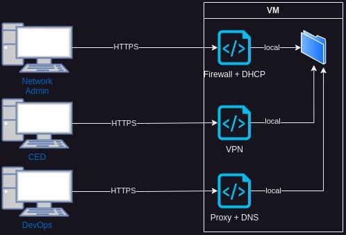
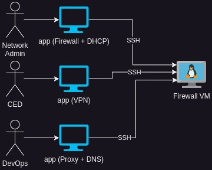

# Actually needed in firewallo

- [ ] Get started guide

- [ ] Script for read allowed host in wg-portal SQLite DB and generate firewallo rulses based on it

- [ ] simple deploy solution

# Firewallo GUI bluerint

#### Defined workflow

it's possible to work with 3 different workflows: base, remote, Manifest based

Application network example

###### Base

Evrything is on firewall VM, the VM expose an HTTPS page where the user can access and interact with.

Like most firewall non-enterprise grade

###### Remote

It work's like Microtik, the user access an app on hes own pc, intertact and in the save process, 

a file will be written via SCP on firewall

###### Manifest

It mimics the devops workflow, there is one or more manifest file where all it's defined.

Firewall listen for changes in S3 (or other) and pull the changes if any

#### Defined technologies

###### Prereq

- No dev env required (ex: JDK / cargo / pip / ecc)

- No dependency for GUI part (Firewallo need: systemd, NFT, iptables, suricata, nano)

- No binary requested outside Debian/Alpine/Nix

##### Suggestion

- Python3 FastAPI + React/Vue in AppImage?

- Rust + Vue? compilable? needs nginx?

- Debian/Aplpine/Nix?

# Note

- Diagrams are made with draw.io you can import the image in draw.io and edit it

## Configuration

Set environment variable DATABASE_TYPE to select metadata backend:

Supported values:
- litedb (default): local JSON file at app/db/metadata.json
- mongodb: requires MONGO_URI (default mongodb://localhost:27017) and optional MONGO_DB_NAME (default firewallo)

Example (.env):

DATABASE_TYPE=litedb
# MONGO_URI=mongodb://mongo:27017
# MONGO_DB_NAME=firewallo