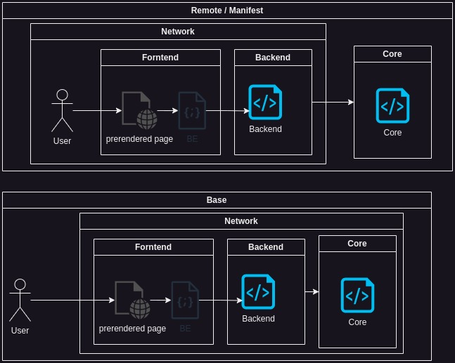
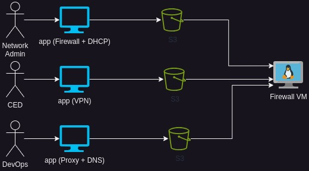

# Firewallo - Extensible Network Management Platform

Firewallo is a comprehensive network management platform built around an extensible plugin framework. While it includes WireGuard VPN management as a core plugin, Firewallo's true power lies in its ability to integrate multiple network technologies through a unified API and management interface. Built with FastAPI and designed for scalability, Firewallo offers both standalone operation and enterprise-grade features.

## 📚 Documentation Structure

### Quick Navigation

- **[Architecture Documentation](./architecture/)** - System design and database architecture
- **[Plugin Documentation](./plugins/)** - Plugin framework, development, and examples
- **[WebUI Documentation](./webui/)** - Web interface implementation and theming
- **[Testing Documentation](./testing/)** - Testing guides and summaries
- **[Developer Guides](./guides/)** - Tutorials and best practices

## 🎯 Overview

Firewallo provides a unified platform for network management through:

- **Plugin Framework** - Extensible architecture supporting VPN, firewall, monitoring, and network tools
- **RESTful API** - Complete API-first design with automatic documentation
- **Modular Architecture** - Plugin-based system for maximum extensibility
- **User Management** - Built-in authentication and role-based access control
- **Multiple Backends** - Support for both local JSON storage (LiteDB) and MongoDB
- **Hot-Reload Support** - Dynamic plugin loading without application restarts
- **Unified Interface** - Single API for managing diverse network technologies

## 🏗️ Architecture

### System Architecture Diagrams

#### Application Architecture


The application follows a clean, modular architecture with clear separation of concerns:
- **API Layer** - FastAPI-based REST endpoints
- **Service Layer** - Business logic for VPN operations
- **Repository Layer** - Data access abstraction
- **Plugin System** - Modular components for different VPN technologies

#### Base Infrastructure


The base infrastructure demonstrates the core components:
- **WireGuard Integration** - Native WireGuard tools integration
- **Database Backends** - Flexible storage options
- **Authentication System** - JWT-based security
- **Configuration Management** - Dynamic config generation

#### Application Manifest


The application manifest shows the complete deployment structure:
- **Container Support** - Docker-based deployment
- **Environment Configuration** - Flexible configuration management
- **Service Dependencies** - Clear dependency management
- **Scaling Considerations** - Designed for horizontal scaling

#### Remote Management


Remote management capabilities include:
- **API Access** - Full remote API control
- **Configuration Distribution** - Centralized config management
- **Monitoring Integration** - Built-in monitoring hooks
- **Multi-Node Support** - Distributed deployment support

### Architecture Documentation

- 📖 **[Clean Architecture Guide](./architecture/CLEAN_ARCHITECTURE.md)** - Clean architecture principles and implementation
- 🗄️ **[Database Architecture](./architecture/DATABASE_ARCHITECTURE.md)** - Complete database design and structure

## 🔌 Plugin System

The plugin framework is the core of Firewallo's extensibility, providing a standardized way to extend functionality.

### Plugin Categories

- **VPN Plugins** (`plugins.vpn.*`) - VPN server and client management
- **Firewall Plugins** (`plugins.firewall.*`) - Firewall rule and policy management
- **Monitoring Plugins** (`plugins.monitoring.*`) - System and network monitoring
- **Network Plugins** (`plugins.network.*`) - DNS, DHCP, and other network services
- **Security Plugins** (`plugins.security.*`) - Security tools and intrusion detection

### Plugin Documentation

- 🔧 **[Plugin Framework](./plugins/FRAMEWORK.md)** - Core framework documentation
- 👨‍💻 **[Development Guide](./plugins/DEVELOPMENT.md)** - How to develop custom plugins
- 📚 **[Plugin Examples](./plugins/EXAMPLES.md)** - Example implementations
- 📦 **[Installation Guide](./plugins/INSTALLATION.md)** - Installing and managing plugins
- 🔄 **[Migration Guide](./plugins/MIGRATION.md)** - Plugin migration strategies
- 📋 **[Menu System](./plugins/MENU_SYSTEM.md)** - Plugin menu integration
- 🎨 **[WebUI Themes](./plugins/WEBUI_THEMES.md)** - Plugin theming support
- 📊 **[Integration Summary](./plugins/FRAMEWORK_INTEGRATION_SUMMARY.md)** - Framework integration overview
- 🌐 **[WebUI Summary](./plugins/WEBUI_SUMMARY.md)** - Plugin WebUI integration

## 🌐 Web Interface

Firewallo includes a modern web interface for managing the platform and its plugins.

### WebUI Documentation

- 🚀 **[WebUI Implementation](./webui/IMPLEMENTATION.md)** - Technical implementation details
- 📖 **[WebUI README](./webui/README.md)** - WebUI overview and setup
- 🎨 **[Theme Guide](./webui/THEME_GUIDE.md)** - Creating and customizing themes

## 🧪 Testing

Comprehensive testing documentation for ensuring quality and reliability.

### Testing Documentation

- ✅ **[Testing Guide](./testing/README.md)** - Complete testing documentation
- 🌐 **[WebUI Tests](./testing/WEBUI_TESTS_SUMMARY.md)** - WebUI testing summary

## 🚀 Key Features

### 🔒 Authentication & Security
- **JWT Authentication** - Secure token-based authentication
- **Role-Based Access Control (RBAC)** - Flexible permission system
- **Password Hashing** - Secure password storage with SHA-256
- **API Security** - Bearer token protection for all endpoints

### 🔌 Extensible Plugin Framework
- **VPN Plugins** - WireGuard, OpenVPN, IPSec, and custom VPN solutions
- **Firewall Plugins** - iptables, nftables, pfSense integration
- **Monitoring Plugins** - Prometheus, Grafana, system monitoring
- **Network Tools** - DNS, DHCP, Load Balancer, Proxy management
- **Hot-Loading** - Install and enable plugins without restarts
- **External Sources** - Install plugins from Git repositories, packages, or registries

### 🌐 Network Management (via Plugins)
- **VPN Management** - Multi-protocol VPN server and client management
- **Firewall Control** - Centralized firewall rule management
- **Network Monitoring** - Real-time network and system monitoring
- **Service Discovery** - Automatic detection and configuration of network services

### 📊 IP Address Management
- **Automatic IP Allocation** - Smart IP assignment within server networks
- **Network Validation** - Comprehensive IP and CIDR validation
- **Conflict Prevention** - Automatic detection of IP conflicts
- **Custom IP Assignment** - Manual IP assignment when needed

### 🗄️ Flexible Data Storage
- **LiteDB Backend** - Simple JSON file storage for development and small deployments
- **MongoDB Backend** - Enterprise-grade database for production environments
- **Data Migration** - Built-in migration tools for database structure updates
- **Backup Support** - Automatic backup creation during migrations

## 📡 API Documentation

Firewallo provides a comprehensive REST API with automatic documentation available at `/api/docs` when running the application.

### Core Endpoints

#### Authentication
- `POST /api/auth/login` - User authentication
- `POST /api/auth/register` - User registration

#### Plugin Management
- `GET /api/plugins/` - List all plugins
- `POST /api/plugins/install` - Install new plugin
- `PUT /api/plugins/{plugin_id}/enable` - Enable plugin
- `DELETE /api/plugins/{plugin_id}` - Uninstall plugin

#### Network Management (Plugin-Dependent)
- `GET /api/vpn/{plugin}/servers/` - List VPN servers (WireGuard, OpenVPN, etc.)
- `POST /api/vpn/{plugin}/servers/` - Create VPN server
- `GET /api/firewall/{plugin}/rules/` - List firewall rules
- `POST /api/monitoring/{plugin}/alerts/` - Create monitoring alert

## 🗂️ Database Structure

Firewallo uses a modular database structure organized into three main sections:

### Plugins Section (`plugins.*`)
```
plugins/
├── vpn/
│   ├── wireguard/
│   │   ├── servers[]
│   │   └── peers[]
│   ├── openvpn/
│   │   ├── servers[]
│   │   └── clients[]
│   └── ipsec/
│       └── tunnels[]
├── firewall/
│   ├── iptables/
│   │   └── rules[]
│   └── nftables/
│       └── rulesets[]
├── monitoring/
│   ├── prometheus/
│   │   ├── targets[]
│   │   └── alerts[]
│   └── grafana/
│       └── dashboards[]
└── network/
    ├── dns/
    │   └── zones[]
    └── dhcp/
        └── pools[]
```

### Core Section (`core.*`)
```
core/
├── system/
├── config/
└── logs[]
```

### Authentication Section (`auth.*`)
```
auth/
├── users[]
└── rbac/
    ├── roles[]
    ├── permissions[]
    └── assignments[]
```

For detailed database architecture information, see [Database Architecture Documentation](./architecture/DATABASE_ARCHITECTURE.md).

## 💻 Installation & Deployment

### Docker Deployment (Recommended)

```bash
# Using Docker Compose
docker-compose up -d

# Or direct Docker run
docker run -d \
  -p 11822:8000 \
  -v firewallo_db:/usr/src/app/db \
  -e CORS_LIST='["*"]' \
  registry.gitlab.com/pietromb/firewallo-ui:latest
```

### Local Development

```bash
# Clone the repository
git clone <repository-url>
cd firewallo-ui

# Create virtual environment
python -m venv .venv
source .venv/bin/activate  # Linux/Mac
# or
.venv\Scripts\activate     # Windows

# Install dependencies
pip install -r requirements.txt

# Run the application
uvicorn app.main:app --reload --host 0.0.0.0 --port 8000
```

### Environment Configuration

Create a `.env` file with your configuration:

```env
# CORS configuration
CORS_LIST=["http://127.0.0.1","http://localhost"]

# Database configuration
DATABASE_TYPE=litedb  # or mongodb
MONGO_URI=mongodb://localhost:27017  # if using MongoDB
MONGO_DB_NAME=firewallo  # if using MongoDB
```

## 📝 Usage Examples

### Installing and Managing Plugins

```bash
# Install a VPN plugin from Git repository
firewallo plugin install https://github.com/developer/openvpn-plugin.git

# Install monitoring plugin from registry
firewallo plugin install prometheus-monitoring

# List available plugins
firewallo plugin list

# Enable a plugin
firewallo plugin enable openvpn

# Configure a plugin
firewallo plugin config set openvpn server_port=1194
```

### Creating Network Resources (Plugin-Dependent)

```bash
# Create a WireGuard VPN server (WireGuard plugin)
curl -X POST "http://localhost:8000/api/vpn/wireguard/servers/" \
  -H "Authorization: Bearer YOUR_TOKEN" \
  -H "Content-Type: application/json" \
  -d '{
    "interface": "wg0",
    "listen_port": 51820,
    "address": "10.0.0.1/24",
    "mtu": 1420
  }'

# Create an OpenVPN server (OpenVPN plugin)
curl -X POST "http://localhost:8000/api/vpn/openvpn/servers/" \
  -H "Authorization: Bearer YOUR_TOKEN" \
  -H "Content-Type: application/json" \
  -d '{
    "name": "office-vpn",
    "port": 1194,
    "protocol": "udp",
    "encryption": "AES-256-GCM"
  }'

# Create firewall rule (iptables plugin)
curl -X POST "http://localhost:8000/api/firewall/iptables/rules/" \
  -H "Authorization: Bearer YOUR_TOKEN" \
  -H "Content-Type: application/json" \
  -d '{
    "name": "Allow SSH",
    "chain": "INPUT",
    "protocol": "tcp",
    "port": 22,
    "action": "ACCEPT"
  }'
```

## 👨‍💻 Development

### Project Structure

```
firewallo-ui/
├── app/
│   ├── main.py              # Application entrypoint
│   ├── api/                 # API routes
│   ├── auth/                # Authentication system
│   ├── core/                # Core application logic
│   ├── db/                  # Database and migration tools
│   ├── plugins/             # Plugin system
│   ├── services/            # Business logic services
│   └── users/               # User management
├── docs/                    # Documentation
│   ├── architecture/        # Architecture documentation
│   ├── plugins/            # Plugin documentation
│   ├── webui/              # WebUI documentation
│   ├── testing/            # Testing documentation
│   ├── guides/             # Developer guides
│   └── images/             # Documentation images
├── docker-compose.yaml      # Docker deployment
├── Dockerfile              # Container definition
└── requirements.txt        # Python dependencies
```

### Key Technologies

- **FastAPI** - Modern Python web framework
- **Uvicorn** - ASGI server
- **PyNaCl** - Cryptographic operations
- **PyJWT** - JWT token handling
- **Motor** - Async MongoDB driver
- **Pydantic** - Data validation

### Contributing

1. Fork the repository
2. Create a feature branch
3. Make your changes
4. Add tests if applicable
5. Submit a pull request

See [CONTRIBUTING.md](../CONTRIBUTING.md) for detailed contribution guidelines.

## ⚙️ Configuration

### Default Credentials
- **Username**: `admin@firewallo.io`
- **Password**: `admin`
- **Email**: `admin@firewallo.io`

⚠️ **Security Note**: Change the default admin password immediately in production environments.

### CORS Configuration
Configure allowed origins via the `CORS_LIST` environment variable:
```json
["http://127.0.0.1", "http://localhost", "https://your-domain.com"]
```

## 📊 Monitoring & Maintenance

### Database Migration
Upgrade database structure when needed:
```bash
python -m app.db.migration app/db/metadata.json
```

### Health Checks
The application exposes health information through the API:
- API Documentation: `/api/docs`
- ReDoc Documentation: `/api/redoc`

### Backup
Regular database backups are recommended, especially before migrations. The migration tool automatically creates backups.

## 📚 Additional Resources

### Internal Documentation
- **[Architecture Docs](./architecture/)** - System design and architecture
- **[Plugin Development](./plugins/)** - Complete plugin documentation
- **[WebUI Documentation](./webui/)** - Web interface documentation
- **[Testing Guides](./testing/)** - Testing documentation

### External Resources
- **API Documentation**: Available at `/api/docs` when running
- **Source Code**: Available in GitLab repository
- **Docker Images**: Available at `registry.gitlab.com/pietromb/firewallo-ui`

## 📄 License

Please refer to the repository license file for licensing information.

---

*Firewallo - Extensible Network Management Platform*